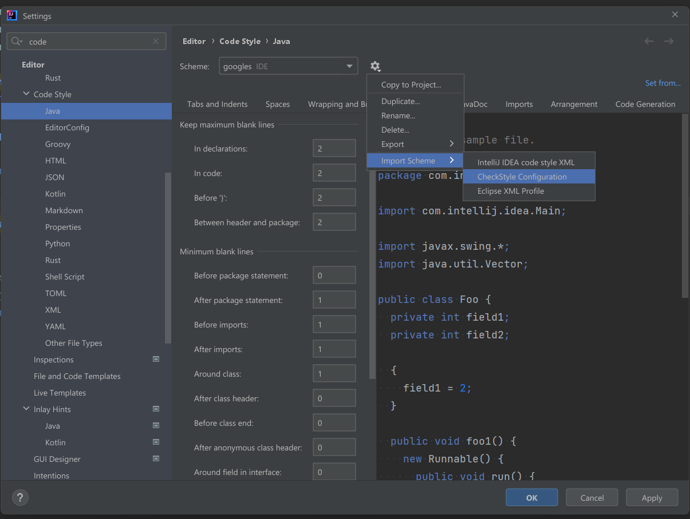
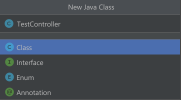
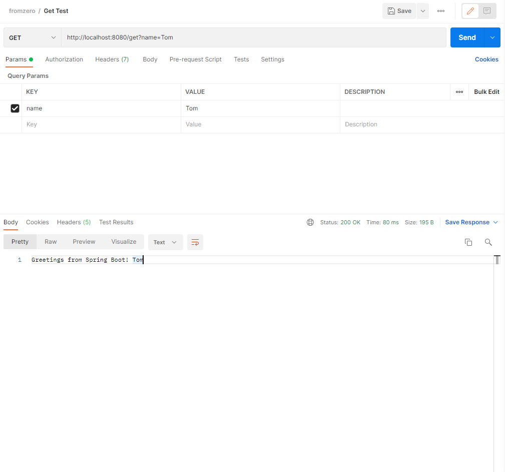
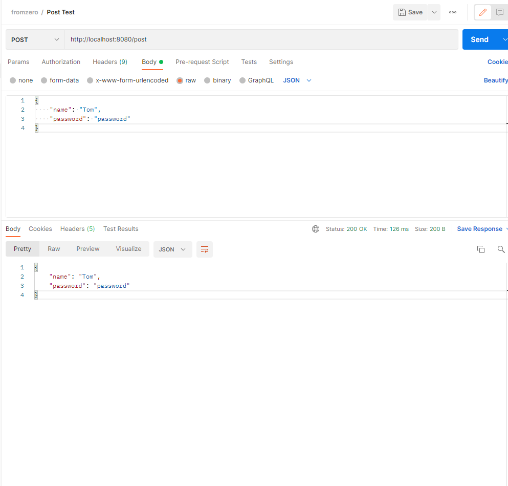

# fromzero
from zero to a project

## 第1步：与前端通信
1. 在Application入口方法同级目录，创建一个package。  

2. 在package中创建controller(MVC架构)  

3. 创建Dto package(User.class) 
https://zh.wikipedia.org/wiki/%E6%95%B0%E6%8D%AE%E4%BC%A0%E8%BE%93%E5%AF%B9%E8%B1%A1
4. 使用`postman`来进行测试(测试文件可以从postman文件导入)  
  

* Http相关知识 **https://developer.mozilla.org/zh-CN/docs/Web/HTTP**
